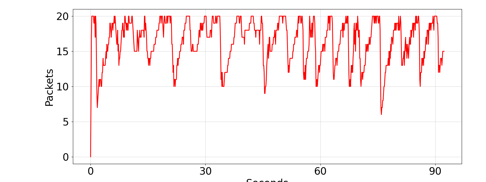
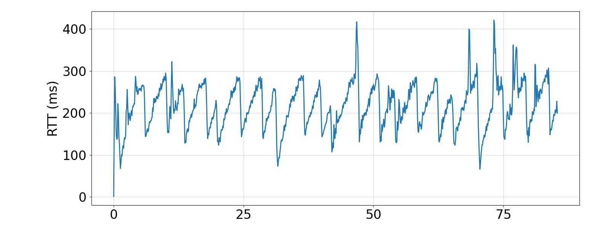
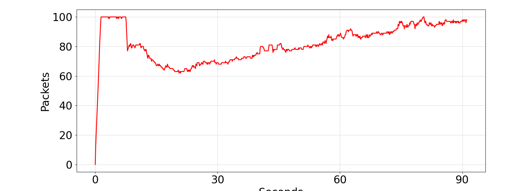
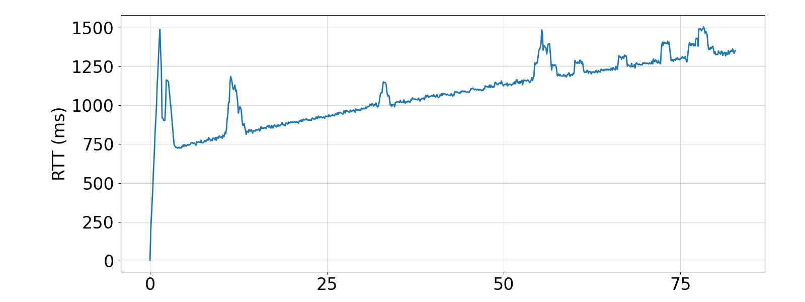

# Relatório de Buffer e Bufferbloat

## 1. Qual é o tempo médio de busca da página da web e seu desvio padrão quando q=20 e q=100?

| Tamanho do Buffer (q) | Tempo Médio (s) | Desvio Padrão (s) |
|-----------------------|-----------------|--------------------|
| 100                   | 2.303103        | 0.699150          |
| 20                    | 0.740095        | 0.495911          |

## 2. Por que você vê uma diferença nos tempos de busca de páginas da Web com buffers de roteador curtos e grandes?

Com um buffer de roteador maior (q=100), o tempo de busca da página da web é mais longo porque o buffer acumula mais pacotes, aumentando o tempo de espera dos pacotes antes da transmissão (*bufferbloat*).

## 3. Bufferbloat pode ocorrer em outros lugares, como sua placa de interface de rede (NIC). Verifique a saída de ifconfig eth0 de sua VM mininet. Qual é o comprimento (máximo) da fila de transmissão na interface de rede relatada pelo ifconfig? Para esse tamanho de fila, se você assumir que a fila é “drenada” a 100 Mb/s, qual é o tempo máximo que um pacote pode esperar na fila antes de sair da NIC?

O comprimento máximo da fila de transmissão (txqueuelen) para a interface de rede h1-eth0 é 1000 pacotes.

Supondo que a fila seja esvaziada a uma taxa de 100 Mb/s e que o tamanho médio de um pacote seja de 1500 bytes, o tempo máximo que um pacote pode esperar na fila é calculado assim:

Tempo máximo de espera = (1000 pacotes * 1500 bytes/pacote * 8) / (100 * 10^6 bits/s) ≈ 120 ms

Portanto, um pacote pode esperar até aproximadamente 120 ms na fila da NIC antes de ser transmitido.

## 4. Como o RTT relatado pelo ping varia com o tamanho da fila? Descreva a relação entre os dois.

Como vemos abaixo, quanto maior a fila de pacotes, maior o tempo de espera e, portanto, maior o RTT. 

## 5. Identifique e descreva duas maneiras de mitigar o problema de bufferbloat.

- Reduzir o tamanho do buffer.
- Alterar o algoritmo de controle de congestionamento do TCP, como para o usado pelo TCP BBR. O BBR ajusta a taxa de envio com base no RTT, sem esperar que pacotes sejam descartados.
